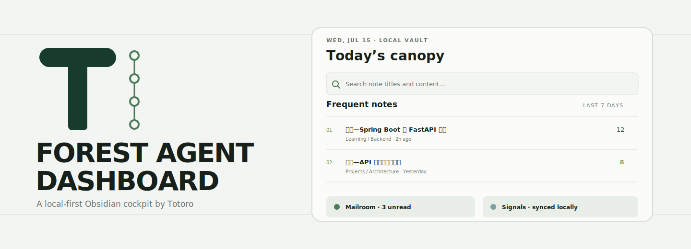
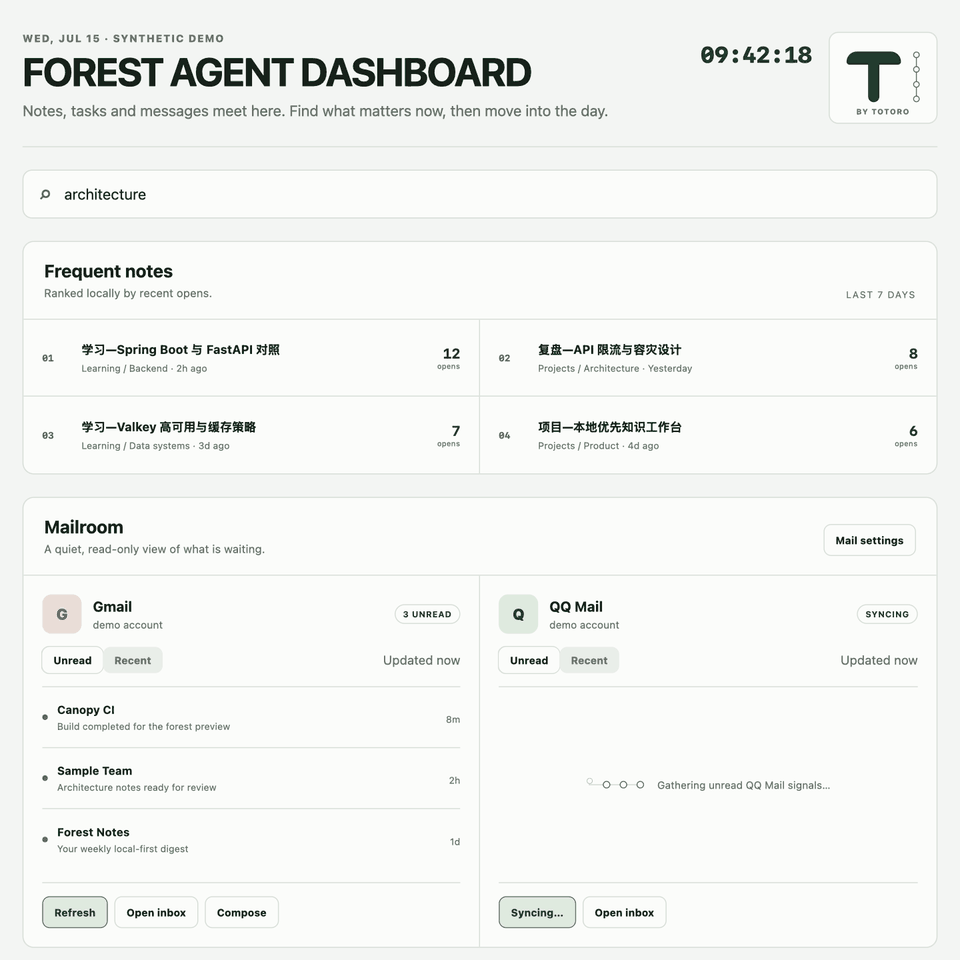

<p align="center">
  
</p>

<p align="center">
  <a href="https://github.com/Totoro-qaq/forest-agent-dashboard/actions/workflows/ci.yml"></a>
  <a href="https://github.com/Totoro-qaq/forest-agent-dashboard/actions/workflows/secret-scan.yml"></a>
  <a href="LICENSE"></a>
</p>

# Forest Agent Dashboard

A local-first desktop dashboard for Obsidian by **Totoro**. Search note titles and content, return to frequently opened notes, manage small tasks, and optionally review read-only mail summaries and public engineering signals in one calm workspace.

> Status: early public preview. Build and review locally before relying on it for daily mail workflows.

<p align="center">
  
</p>

## What it does

- Searches Markdown titles, paths, tags, and note content locally.
- Ranks frequent notes using a rolling local open history.
- Keeps a lightweight task list in plugin data.
- Shows read-only Gmail metadata through Google OAuth.
- Shows read-only QQ Mail headers through IMAP.
- Surfaces GitHub star signals and Hacker News stories.
- Uses a coordinated GSAP loading state with reduced-motion support.
- Supports an optional vault-local mascot image without shipping one.

No vault content is uploaded by the plugin. Network features are opt-in and are described in [PRIVACY.md](PRIVACY.md).

## Visual identity

The Forest T and Canopy rail are original project marks. The public plugin does **not** include, trace, or redraw any Studio Ghibli character or artwork. “Totoro” is the author identity; it is not a claim of affiliation or endorsement.

## Install from source

Requirements: desktop Obsidian, Node.js 18 or newer, and npm.

```bash
npm install
npm run verify
```

Copy these release files into:

```text
<vault>/.obsidian/plugins/forest-agent-dashboard/
  main.js
  manifest.json
  styles.css
```

Then reload Obsidian and enable **Forest Agent Dashboard** under **Settings → Community plugins**.

## Open the dashboard

- Select the forest ribbon icon; or
- run **Forest Agent Dashboard: Open dashboard** from the command palette.

Core note, task, and search features work without external accounts.

## Gmail setup

1. Enable the Gmail API in a Google Cloud project.
2. Configure the OAuth consent screen and add your own account as a test user while the app remains in testing.
3. Create an OAuth client of type **Desktop app**.
4. In plugin settings, paste the client ID. The desktop client secret is optional for installed-app clients.
5. Select **Connect Gmail** and grant the read-only `gmail.metadata` scope.

The client ID is ordinary plugin configuration. OAuth tokens and any client secret are stored using Obsidian secure storage when available, with a macOS Keychain fallback.

## QQ Mail setup

1. Enable IMAP in QQ Mail.
2. Generate a QQ Mail authorization code.
3. Add the mailbox address and authorization code in plugin settings.

Use the authorization code, never the QQ account password. The code is stored in secure storage and message headers remain in memory.

## GitHub token

A token is optional. Public trending pages and unauthenticated API access work with lower rate limits. If supplied, the token is stored in secure storage and is used only as a GitHub API authorization header. It is never written back into normal plugin settings.

## Local customization

Set **Custom mascot image** to a vault-relative path if you want a private image in your own header. The path and image are local; no custom image is included in releases or demo material.

## Development

```bash
npm run dev
npm run check:repo
npm test
npm run build
```

Release artifacts are `main.js`, `manifest.json`, and `styles.css`. Do not commit `data.json`, credentials, private vault fixtures, or personal screenshots.

## Design and product decisions

- [PRODUCT.md](PRODUCT.md)
- [DESIGN.md](DESIGN.md)
- [PRIVACY.md](PRIVACY.md)
- [SECURITY.md](SECURITY.md)

## Acknowledgement

The idea of treating an Obsidian vault as an agent-oriented dashboard was conceptually inspired by [Jason Zhou's article about an Obsidian Agent Dashboard](https://jasonai.me/blog/codex-obsidian-agent-dashboard-plugin/). This repository is an independent implementation with original code, copy, fixtures, and visual identity; it is not affiliated with that author or project.

## License

[MIT](LICENSE) © 2026 Totoro.

## Community

Bug reports and feature proposals are welcome through the repository forms. Please read [CONTRIBUTING.md](CONTRIBUTING.md), [CODE_OF_CONDUCT.md](CODE_OF_CONDUCT.md), and [SECURITY.md](SECURITY.md) before opening a contribution. Never attach a real vault, mailbox screenshot, address, OAuth response, or token.
