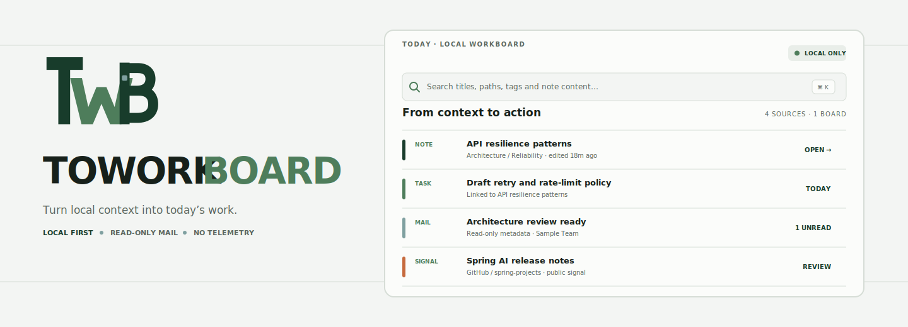
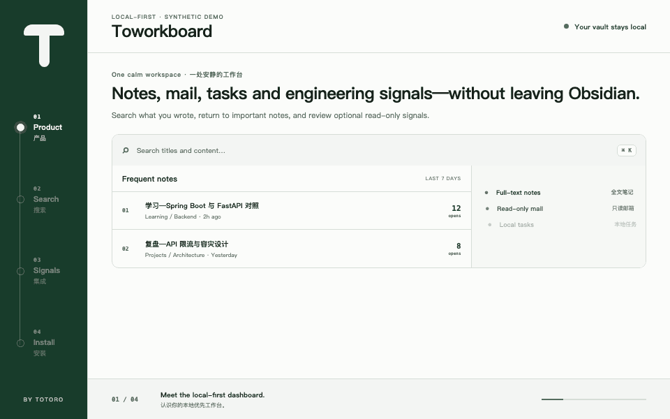

<p align="right">
  <strong>English</strong> · <a href="README.zh-CN.md">简体中文</a>
</p>

<p align="center">
  
</p>

<p align="center">
  <a href="https://github.com/Totoro-qaq/toworkboard/actions/workflows/ci.yml"></a>
  <a href="https://github.com/Totoro-qaq/toworkboard/actions/workflows/secret-scan.yml"></a>
  <a href="LICENSE"></a>
</p>

# Toworkboard

A local-first desktop workspace for Obsidian by **Totoro**. It brings note search, frequent notes, small tasks, read-only mail summaries, and optional engineering signals into one calm dashboard.

> **Early public preview:** install it manually and review the privacy notes before connecting mail. It is not in the Obsidian Community Plugins catalog yet.

<p align="center">
  
</p>

The animated tour uses synthetic notes and accounts. It demonstrates four real workflows: product overview, full-text vault search, optional signal loading, and local installation.

## Why this dashboard

Obsidian already holds the context. Toworkboard gives that context an operational surface without moving the vault into a hosted service.

- **Find:** search Markdown titles, paths, tags, and note content locally.
- **Return:** rank frequently opened notes using local history.
- **Act:** keep a lightweight task list beside the notes that informed it.
- **Review:** glance at read-only Gmail and QQ Mail metadata.
- **Notice:** optionally follow GitHub repositories and Hacker News stories.

Core note, search, and task features work offline. Network integrations are explicit and optional.

## Install

Requirements: Obsidian 1.8 or newer, desktop only. Building from source also requires Node.js 18 or newer and npm.

### Option A — install the release

1. Download `main.js`, `manifest.json`, and `styles.css` from the [latest release](https://github.com/Totoro-qaq/toworkboard/releases/latest).
2. Create this folder inside your vault:

   ```text
   <vault>/.obsidian/plugins/toworkboard/
   ```

3. Copy the three downloaded files into that folder.
4. Restart Obsidian or select **Reload app without saving** from the command palette.
5. Open **Settings → Community plugins**, turn off Restricted mode if needed, and enable **Toworkboard**.

### Option B — build from source

```bash
git clone https://github.com/Totoro-qaq/toworkboard.git
cd toworkboard
npm ci
npm run verify
```

Then copy the generated `main.js`, plus `manifest.json` and `styles.css`, into:

```text
<vault>/.obsidian/plugins/toworkboard/
```

Reload Obsidian and enable the plugin under **Settings → Community plugins**.

## Use it

### Open the dashboard

- Select the Toworkboard icon in the left ribbon; or
- run **Toworkboard: Open dashboard** from the command palette.

### Search notes

Select the search field and enter any title, path, tag, or phrase from a Markdown note. Results include the note title, location, and a matching excerpt. Selecting a result opens the original note.

### Return to frequent notes

Open notes normally. The dashboard records a rolling local count and places the most frequently opened notes in **Frequent notes**. Use **Browse all notes** for the complete vault list. You can clear only this dashboard history from plugin settings; no note is changed.

### Manage tasks

Add small working tasks from the dashboard, mark them complete, or remove them. Tasks stay in local plugin data and do not modify note files.

### Review Mailroom

Mailroom keeps Gmail and QQ Mail in separate fixed-height panes. Switch between **Unread** and **Recent**, page through the configured in-memory result limit, and select a message to open it in the provider's inbox. The plugin does not mark messages read, send mail, or download bodies.

### Review engineering signals

GitHub and Hacker News panels are opt-in. Refresh them when needed; their loading state uses the same Canopy rail language as Mailroom and honors reduced-motion preferences.

## Optional integrations

| Integration | What it reads | Credential |
| --- | --- | --- |
| Gmail | Read-only message metadata and Inbox counters | Google Desktop OAuth client |
| QQ Mail | IMAP headers within the configured limit | QQ Mail authorization code |
| GitHub | Public repository and star signals | Optional fine-grained token for higher limits |
| Hacker News | Public story metadata | None |

### Connect Gmail

1. Enable the Gmail API in a Google Cloud project.
2. Configure the OAuth consent screen. While the app is in testing, add your Google account as a test user.
3. Create an OAuth client of type **Desktop app**.
4. Paste the client ID into **Toworkboard settings → Gmail OAuth client ID**. The desktop client secret is optional for installed-app clients.
5. Open the dashboard, select **Connect Gmail**, and grant the read-only `gmail.metadata` scope.

OAuth tokens and an optional client secret use Obsidian secure storage when available, with a macOS Keychain fallback.

### Connect QQ Mail

1. Enable IMAP in QQ Mail.
2. Generate a QQ Mail authorization code.
3. Enter the mailbox address and authorization code in plugin settings.

Use the authorization code, never the QQ account password.

### Configure GitHub

Public data works without a token at lower rate limits. If you add a token, use a fine-grained token with the minimum read-only permissions. It is stored in secure storage and used only in the GitHub authorization header.

## Privacy and security

- Vault search and history stay on the device.
- The plugin has no analytics or hidden telemetry.
- Mail integrations request read-only access and keep headers in memory.
- Credentials are never written into normal plugin settings when secure storage is available.
- Demo assets contain synthetic content only.

Read [PRIVACY.md](PRIVACY.md) for the network and storage boundary, and [SECURITY.md](SECURITY.md) before reporting a vulnerability. Never attach a real vault, mailbox screenshot, OAuth response, app password, or token to an issue.

## Local customization

Set **Custom mascot image** to a vault-relative path if you want a private image in your own header. The image remains local and is not included in releases or public demo material.

## Development

```bash
npm run dev
npm run check:repo
npm test
npm run build
```

Release artifacts are `main.js`, `manifest.json`, and `styles.css`. Do not commit `data.json`, credentials, private vault fixtures, or personal screenshots.

Project decisions are documented in [PRODUCT.md](PRODUCT.md), [DESIGN.md](DESIGN.md), [PRIVACY.md](PRIVACY.md), and [CHANGELOG.md](CHANGELOG.md).

## Visual identity and acknowledgement

The Canopy T and Canopy rail are original project marks. The public plugin does **not** include, trace, or redraw any Studio Ghibli character or artwork. “Totoro” is the author identity, not a claim of affiliation or endorsement.

The idea of treating an Obsidian vault as an agent-oriented dashboard was conceptually inspired by [Jason Zhou's Obsidian Agent Dashboard article](https://jasonai.me/blog/codex-obsidian-agent-dashboard-plugin/). This repository is an independent implementation with original code, copy, fixtures, and visual identity.

## Contributing and license

Bug reports and feature proposals are welcome. Read [CONTRIBUTING.md](CONTRIBUTING.md), [CODE_OF_CONDUCT.md](CODE_OF_CONDUCT.md), and [SECURITY.md](SECURITY.md) first.

[MIT](LICENSE) © 2026 Totoro.
