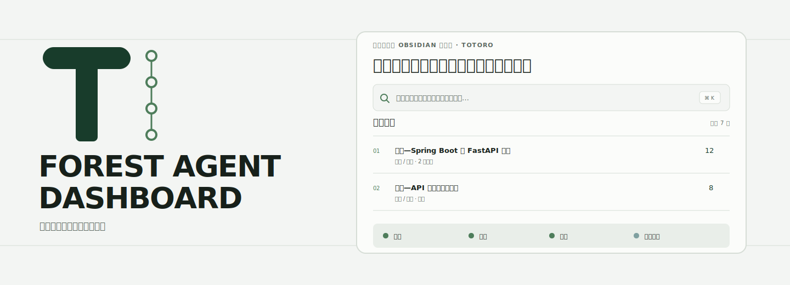

<p align="right">
  <a href="README.md">English</a> · <strong>简体中文</strong>
</p>

<p align="center">
  
</p>

<p align="center">
  <a href="https://github.com/Totoro-qaq/toworkboard/actions/workflows/ci.yml"></a>
  <a href="https://github.com/Totoro-qaq/toworkboard/actions/workflows/secret-scan.yml"></a>
  <a href="LICENSE"></a>
</p>

# Toworkboard

由 **Totoro** 开发的 Obsidian 本地优先桌面工作台。它把笔记搜索、常用笔记、小任务、只读邮箱摘要和可选的工程信号放进一个安静、紧凑的 Dashboard。

> **早期公开预览：** 请手动安装，并在连接邮箱前阅读隐私说明。目前尚未进入 Obsidian 社区插件市场。

<p align="center">
  
</p>

演示中的笔记和账号均为合成数据。GIF 依次展示四个真实流程：产品概览、知识库全文搜索、可选信号加载和本地安装。

## 为什么做这个 Dashboard

上下文本来就存放在 Obsidian 里。Toworkboard 为这些上下文提供一个可以行动的界面，同时不要求你把知识库迁移到托管服务。

- **查找：** 在本地搜索 Markdown 标题、路径、标签和正文。
- **返回：** 根据本地打开历史排列常用笔记。
- **行动：** 在相关笔记旁维护轻量任务。
- **查看：** 浏览只读的 Gmail 与 QQ 邮箱元数据。
- **关注：** 按需查看 GitHub 项目和 Hacker News 工程资讯。

笔记、搜索与任务功能可以离线使用；所有网络集成都需要明确配置，并且可以不启用。

## 安装

运行要求：Obsidian 1.8 或更高版本，仅支持桌面端。从源码构建还需要 Node.js 18 或更高版本与 npm。

### 方式 A——安装发布版本

1. 从[最新 Release](https://github.com/Totoro-qaq/toworkboard/releases/latest)下载 `main.js`、`manifest.json` 和 `styles.css`。
2. 在你的知识库中创建以下目录：

   ```text
   <你的知识库>/.obsidian/plugins/toworkboard/
   ```

3. 把下载的三个文件复制到该目录。
4. 重启 Obsidian，或者在命令面板执行 **Reload app without saving**。
5. 打开 **设置 → 第三方插件**，按需关闭安全模式，然后启用 **Toworkboard**。

### 方式 B——从源码构建

```bash
git clone https://github.com/Totoro-qaq/toworkboard.git
cd toworkboard
npm ci
npm run verify
```

把构建出的 `main.js`，连同 `manifest.json`、`styles.css` 一起复制到：

```text
<你的知识库>/.obsidian/plugins/toworkboard/
```

重新加载 Obsidian，然后在 **设置 → 第三方插件** 中启用插件。

## 如何使用

### 打开 Dashboard

- 点击左侧 Ribbon 中的森林图标；或者
- 在命令面板执行 **Toworkboard: Open dashboard**。

### 搜索笔记

点击搜索框，输入标题、路径、标签，或者 Markdown 正文中的任意短语。结果会显示笔记标题、位置和命中片段；点击结果即可打开原笔记。

### 使用常用笔记

像平时一样打开笔记即可。Dashboard 会在本地记录滚动计数，并把最常打开的内容放入 **Frequent notes**。使用 **Browse all notes** 查看完整笔记列表。你可以在插件设置里只清除 Dashboard 的打开历史，不会修改任何笔记。

### 管理任务

可以直接在 Dashboard 中添加、完成或删除小任务。任务保存在本地插件数据中，不会改写笔记文件。

### 查看 Mailroom

Gmail 和 QQ Mail 使用两个互不影响、固定高度的面板。你可以切换 **Unread** 与 **Recent**，在配置的内存上限内分页，并点击邮件跳转到原邮箱。插件不会标记已读、发送邮件或下载正文。

### 查看工程信号

GitHub 与 Hacker News 面板均为可选功能。需要时手动刷新；加载过程使用与 Mailroom 一致的 Canopy rail 动效，并遵守系统的“减少动态效果”设置。

## 可选集成

| 集成 | 读取内容 | 凭据 |
| --- | --- | --- |
| Gmail | 只读邮件元数据与 Inbox 计数 | Google 桌面 OAuth 客户端 |
| QQ Mail | 配置数量范围内的 IMAP 邮件头 | QQ 邮箱授权码 |
| GitHub | 公开仓库与 Star 信号 | 可选的细粒度 Token，用于提高限额 |
| Hacker News | 公开文章元数据 | 无 |

### 连接 Gmail

1. 在 Google Cloud 项目中启用 Gmail API。
2. 配置 OAuth 同意屏幕；应用处于测试状态时，把自己的 Google 账号加入测试用户。
3. 创建类型为 **Desktop app** 的 OAuth 客户端。
4. 把客户端 ID 粘贴到 **Toworkboard 设置 → Gmail OAuth client ID**。对于已安装应用，桌面客户端密钥可以不填。
5. 回到 Dashboard，点击 **Connect Gmail**，授予只读的 `gmail.metadata` 权限。

OAuth Token 和可选客户端密钥会优先存入 Obsidian 安全存储，并在 macOS 上提供 Keychain 回退。

### 连接 QQ Mail

1. 在 QQ 邮箱中启用 IMAP。
2. 生成 QQ 邮箱授权码。
3. 在插件设置中填写邮箱地址和授权码。

请使用授权码，不要填写 QQ 账号密码。

### 配置 GitHub

公开数据无需 Token 也能使用，但请求限额更低。如果需要添加 Token，请使用最小只读权限的细粒度 Token。它保存在安全存储中，并且只会出现在 GitHub API 的授权请求头里。

## 隐私与安全

- 知识库搜索和打开历史留在本机。
- 插件没有分析统计或隐藏遥测。
- 邮箱集成只申请只读访问，并把邮件头保存在内存中。
- 安全存储可用时，凭据不会写入普通插件设置。
- 公开演示素材只包含合成内容。

网络与存储边界请查看 [PRIVACY.md](PRIVACY.md)；报告安全问题前请阅读 [SECURITY.md](SECURITY.md)。Issue 中不要附带真实知识库、邮箱截图、OAuth 响应、授权码或 Token。

## 本地个性化

如果想在自己的 Header 中使用私人图片，可以把 **Custom mascot image** 设置为知识库内的相对路径。图片只在本地使用，不会进入 Release 或公开演示素材。

## 开发

```bash
npm run dev
npm run check:repo
npm test
npm run build
```

发布文件是 `main.js`、`manifest.json` 和 `styles.css`。不要提交 `data.json`、凭据、私人知识库样例或个人截图。

产品与设计决策记录在 [PRODUCT.md](PRODUCT.md)、[DESIGN.md](DESIGN.md)、[PRIVACY.md](PRIVACY.md) 和 [CHANGELOG.md](CHANGELOG.md)。

## 视觉身份与致谢

Canopy T 和 Canopy rail 是本项目的原创标识。公开插件不会包含、临摹或重绘 Studio Ghibli 的角色或作品。“Totoro”是作者身份，并不表示存在官方关联或背书。

把 Obsidian 知识库作为 Agent Dashboard 的构想在概念上受到 [Jason Zhou 的 Obsidian Agent Dashboard 文章](https://jasonai.me/blog/codex-obsidian-agent-dashboard-plugin/)启发。本仓库是独立实现，代码、文案、演示数据与视觉身份均为原创。

## 参与贡献与许可证

欢迎提交 Bug 和功能建议。请先阅读 [CONTRIBUTING.md](CONTRIBUTING.md)、[CODE_OF_CONDUCT.md](CODE_OF_CONDUCT.md) 和 [SECURITY.md](SECURITY.md)。

[MIT](LICENSE) © 2026 Totoro。
